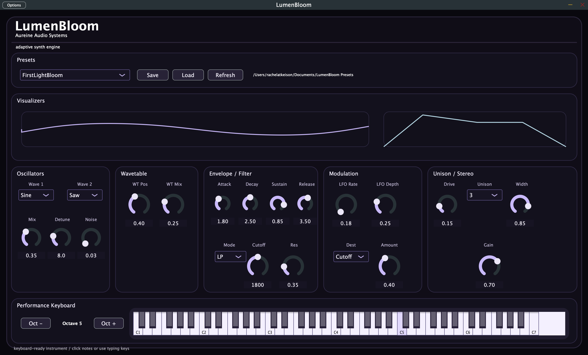
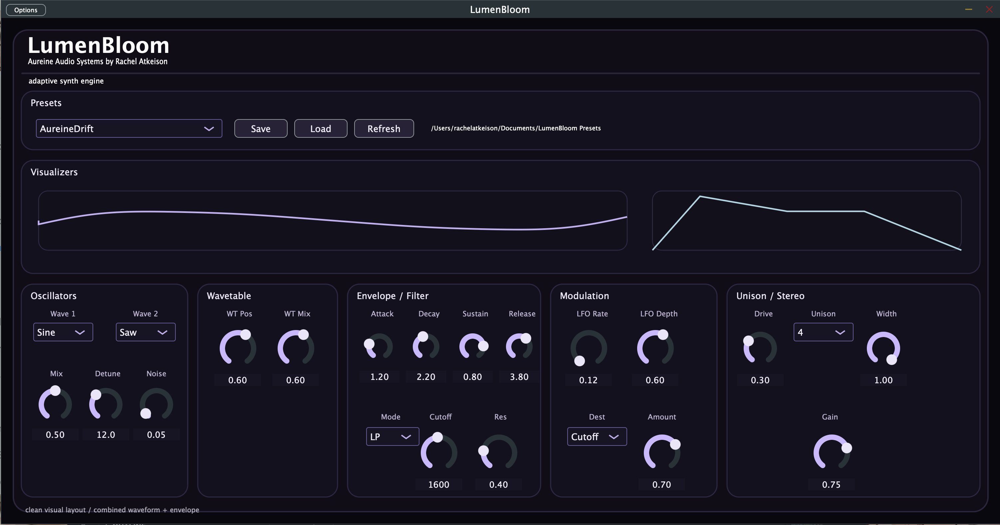
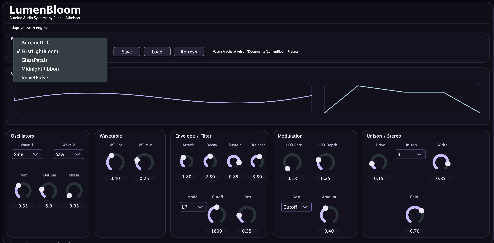

# LumenBloom

**Adaptive Synth Engine — Aureine Audio Systems**

LumenBloom is a polyphonic synthesizer plugin built in C++ using JUCE.  
I built this as a portfolio project to better understand real-time audio systems while also creating something that actually feels good to play.

---

## 🎧 Demo

👉 [](https://www.youtube.com/watch?v=n7tlvAG7nyU)

---

## ✨ Overview

This is a fully functional synth engine built from scratch — not just a basic oscillator demo.

The main goal wasn’t just technical correctness, but to make something that feels:
- responsive  
- atmospheric  
- musically expressive  

A lot of the design decisions came from that idea.

---

## 🔊 Features

### Core DSP
- Polyphonic voice architecture  
- Dual oscillators (sine / square / saw)  
- Wavetable blending  
- ADSR envelope  
- Multimode filter (LP / HP / BP)  
- LFO modulation  
- Modulation routing (cutoff / wavetable / pitch)

### Sound Design
- Detune + unison voices  
- Noise layer  
- Stereo width control  
- Soft drive / saturation  
- Velocity-sensitive performance keyboard  

### Effects
- Delay  
- Reverb  
- Stereo widening  

### Plugin + System
- VST3 plugin support  
- Standalone application  
- Preset save / load system  
- MIDI input support  
- DAW automation (APVTS)

### Interface
- Custom JUCE UI  
- Waveform visualizer  
- Envelope visualizer  
- Interactive keyboard with glow feedback  

---

## 🧠 Signal Flow

```

MIDI → Voice → Oscillators → Wavetable → Envelope → Filter → Modulation → Effects → Output

````

Each note creates its own voice, and that voice runs the full signal chain in real time.

I tried to keep this structure pretty modular so it doesn’t become impossible to expand later.

---

## 🛠️ Tech Stack

- C++  
- JUCE Framework  
- CMake  
- Xcode (macOS)

---

## 🚀 Build Instructions

```bash
git clone https://github.com/rachelatkeison/LumenBloom.git
cd LumenBloom
cmake -B build
cmake --build build
````

### Run

Standalone:

```
build/LumenBloom_artefacts/Standalone/
```

Plugin:

* Load the VST3 in your DAW (REAPER recommended)

---

## 🎨 Design Approach

LumenBloom was designed to feel more like an instrument than a tool.

I focused on:

* keeping the interface minimal
* making controls feel smooth and intentional
* designing presets that actually show what the engine can do

Some parts of the system are intentionally simple right now so they’re easier to expand later (especially the modulation system).

---

## 📸 Screenshots

### Main Interface

A full view of LumenBloom showing the synth layout, visualizers, preset controls, and performance keyboard.



---

### Waveform + Envelope Visualization

A closer look at the combined waveform viewer and envelope display while the synth is active.



---

### Performance + Preset Workflow

The interactive keyboard, preset system, and expressive control surface used during testing and demo playback.



---

## 📁 Project Structure

```
Source/
  PluginProcessor.*   // DSP + engine
  PluginEditor.*      // UI
  SynthVoice.*        // voice system
  Oscillator.*        // waveform generation
  SynthSound.*        // voice binding

JUCE/
CMakeLists.txt
```

---

## 💫 About

**Rachel Atkeison**
Computer Science + Music Technology

LumenBloom is part of my *Aureine Audio Systems* portfolio, focused on building expressive audio software and digital instruments.

---

## 📬 Contact

GitHub: [https://github.com/rachelatkeison](https://github.com/rachelatkeison)
LinkedIn: [https://www.linkedin.com/in/rachel-atkeison](https://www.linkedin.com/in/rachel-atkeison)

````
